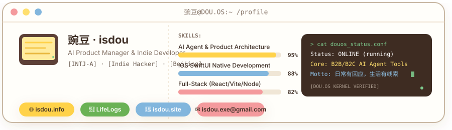

<div align="center">

<!-- Header Capsule Render -->


<!-- Typing Animation Subtitle -->
<a href="https://github.com/isdou">
  
</a>

<br/>

<!-- Status Badges -->
[](https://isdou.info)
[](https://isdou.site)
[](https://github.com/isdou)

</div>

---

## 👤 About Me / 个人档案

```yaml
system_diagnostics:
  status: "ONLINE"
  mbti: "INTJ-A (The Architect)"
  role: "AI Product Manager & Indie Developer"
  location: "Beijing, China 🏙️"
  philosophy: "日常有回应，生活有线索。让技术轻软、安静、有用。"

core_focus:
  - "Designing and building B2B & B2C AI agent applications"
  - "iOS native app development using Swift & SwiftUI"
  - "Warm & retro-modern glassmorphism UI design"
  - "Data aggregation, movie logging (Douban) & digital archiving"
```

---

## 🚀 Projects Showcase / 作品展

<!-- QualityLens -->
<table width="100%" border="1" cellpadding="8" cellspacing="0">
  <tr bgcolor="#fff8eb">
    <td colspan="2">
      <font size="3">🔴 🟡 🔵</font> &nbsp;
      <font color="#3d281a" face="Georgia, serif"><b>🔍 QualityLens</b></font> &nbsp;&nbsp;
      <kbd>B2B SaaS</kbd> &nbsp; <kbd>Private Beta</kbd>
    </td>
  </tr>
  <tr>
    <td width="30%" valign="top" bgcolor="#fffcf6">
      <font size="2" color="#7d685c"><b>PRODUCT SPEC:</b></font><br/>
      <font size="2" color="#3d281a">智能售后质量整改平台</font><br/><br/>
      <font size="2" color="#7d685c"><b>ARCH:</b></font><br/>
      <font size="2" color="#3d281a">Express + Vite</font>
    </td>
    <td valign="top" bgcolor="#ffffff">
      <ul>
        <li>专为鞋服与服装供应链打造，对接 Shopify / Amazon Reviews / Zendesk 等 DTC 电商与客服工单数据流。</li>
        <li>通过大语言模型自动识别售后质量瑕疵，进行舆情聚类与供应商信誉风险评级。</li>
        <li>集成 8D 纠正行动公函 (CAR) 一键 AI 编译会签流程，内置<b>飞织鞋面受热尺寸变异预测模拟器</b>辅助打版加放。</li>
      </ul>
    </td>
  </tr>
  <tr bgcolor="#fffdfa">
    <td colspan="2">
      <table width="100%" border="0" cellpadding="2" cellspacing="0">
        <tr>
          <td width="33%"><font size="1" color="#7d685c">核心特色</font><br/><font size="2" color="#3d281a"><b>8D 报告一键生成</b></font></td>
          <td width="33%"><font size="1" color="#7d685c">工艺仿真</font><br/><font size="2" color="#3d281a"><b>飞织受热变形模拟</b></font></td>
          <td width="33%"><font size="1" color="#7d685c">数据集成</font><br/><font size="2" color="#3d281a"><b>DTC 售后舆情聚类</b></font></td>
        </tr>
      </table>
    </td>
  </tr>
</table>

<br/>

<!-- Lifelogs -->
<table width="100%" border="1" cellpadding="8" cellspacing="0">
  <tr bgcolor="#fff8eb">
    <td colspan="2">
      <font size="3">🔴 🟡 🔵</font> &nbsp;
      <font color="#3d281a" face="Georgia, serif"><b>🌱 Lifelogs (Ply)</b></font> &nbsp;&nbsp;
      <kbd>iOS App</kbd> &nbsp; <kbd>App Store Live</kbd>
    </td>
  </tr>
  <tr>
    <td width="30%" valign="top" bgcolor="#fffcf6">
      <font size="2" color="#7d685c"><b>PRODUCT SPEC:</b></font><br/>
      <font size="2" color="#3d281a">五年日记·生活记录</font><br/><br/>
      <font size="2" color="#7d685c"><b>ARCH:</b></font><br/>
      <font size="2" color="#3d281a">SwiftUI + CoreData</font>
    </td>
    <td valign="top" bgcolor="#ffffff">
      <ul>
        <li>“同一天，五年的你”——温情记录每一个今天，在时间维度中回望心路成长，防范时间压缩效应（Temporal Compression）。</li>
        <li>深度集成 **DeepSeek API 情感引擎**，在月末基于你的 **MBTI 人格画像类型**（如 ENTP/INFP/ISFJ/ESFP）以特定性格语调生成专属总结报告。</li>
        <li>纯原生 Swift / SwiftUI 开发，集成 iCloud 同步 (`iCloudSyncManager`)、流式音频记事 (`VoiceRecorderView`) 与 Markdown 编辑组件。</li>
      </ul>
    </td>
  </tr>
  <tr bgcolor="#fffdfa">
    <td colspan="2">
      <table width="100%" border="0" cellpadding="2" cellspacing="0">
        <tr>
          <td width="33%"><font size="1" color="#7d685c">记录维度</font><br/><font size="2" color="#3d281a"><b>五年“今天”时空同屏</b></font></td>
          <td width="33%"><font size="1" color="#7d685c">AI 赋能</font><br/><font size="2" color="#3d281a"><b>MBTI 个性化月度总结</b></font></td>
          <td width="33%"><font size="1" color="#7d685c">系统同步</font><br/><font size="2" color="#3d281a"><b>iCloud 无缝云端协作</b></font></td>
        </tr>
      </table>
    </td>
  </tr>
</table>

<br/>

<!-- Aoleme Ecosystem -->
<table width="100%" border="1" cellpadding="8" cellspacing="0">
  <tr bgcolor="#fff8eb">
    <td colspan="2">
      <font size="3">🔴 🟡 🔵</font> &nbsp;
      <font color="#3d281a" face="Georgia, serif"><b>🧘 熬了么 &amp; UI Skill</b></font> &nbsp;&nbsp;
      <kbd>Hybrid iOS App</kbd> &nbsp; <kbd>OpenClaw Skill</kbd>
    </td>
  </tr>
  <tr>
    <td width="30%" valign="top" bgcolor="#fffcf6">
      <font size="2" color="#7d685c"><b>PRODUCT SPEC:</b></font><br/>
      <font size="2" color="#3d281a">修仙健康追踪系统</font><br/><br/>
      <font size="2" color="#7d685c"><b>ARCH:</b></font><br/>
      <font size="2" color="#3d281a">React 19 + Capacitor 8</font>
    </td>
    <td valign="top" bgcolor="#ffffff">
      <ul>
        <li><b>熬了么 App</b>：修仙主题健康与睡眠追踪混合应用。深度集成 Apple HealthKit 接口，将物理运动步数与睡眠数据结算为修仙功德/修为，内置宗门社交与冥界游历游戏系统。</li>
        <li><b>Cyber Fantasy UI Skill</b>：面向 OpenClaw 的智能设计 Skill，专用于生成液态进度条、紫色暗色霓虹与玻璃拟态修仙面板，提供可插拔的 Tailwind 配置与 CSS 动效库。</li>
        <li><b>性能优化</b>：深度实践 React 组件 `memo` 缓存、懒加载代码分割与 Web 帧率优化，首屏加载提升超 70%。</li>
      </ul>
    </td>
  </tr>
  <tr bgcolor="#fffdfa">
    <td colspan="2">
      <table width="100%" border="0" cellpadding="2" cellspacing="0">
        <tr>
          <td width="33%"><font size="1" color="#7d685c">核心概念</font><br/><font size="2" color="#3d281a"><b>物理运动结算功德</b></font></td>
          <td width="33%"><font size="1" color="#7d685c">智能设计</font><br/><font size="2" color="#3d281a"><b>赛博霓虹 &amp; 液态进度条</b></font></td>
          <td width="33%"><font size="1" color="#7d685c">性能打磨</font><br/><font size="2" color="#3d281a"><b>React.memo &amp; 懒加载</b></font></td>
        </tr>
      </table>
    </td>
  </tr>
</table>

<br/>

<!-- ClimbOS & Budget -->
<table width="100%" border="1" cellpadding="8" cellspacing="0">
  <tr bgcolor="#fff8eb">
    <td colspan="2">
      <font size="3">🔴 🟡 🔵</font> &nbsp;
      <font color="#3d281a" face="Georgia, serif"><b>🧗 ClimbOS &amp; 记账 App</b></font> &nbsp;&nbsp;
      <kbd>iOS Native</kbd> &nbsp; <kbd>MVP / Private</kbd>
    </td>
  </tr>
  <tr>
    <td width="30%" valign="top" bgcolor="#fffcf6">
      <font size="2" color="#7d685c"><b>PRODUCT SPEC:</b></font><br/>
      <font size="2" color="#3d281a">抱石打卡 &amp; 玻璃拟态记账</font><br/><br/>
      <font size="2" color="#7d685c"><b>ARCH:</b></font><br/>
      <font size="2" color="#3d281a">SwiftUI + CoreData</font>
    </td>
    <td valign="top" bgcolor="#ffffff">
      <ul>
        <li><b>ClimbOS (climb)</b>：专为攀岩/抱石爱好者设计的训练打卡 App。提供 V-grade (V0-V10+) 难度分布直方图，按岩壁倾角（slab/overhang/cave）及把手类型（crimp/sloper/pinch/pocket）记录攀爬尝试与成功率，内置 Plateau 瓶颈分析与自动悬挂板训练方案。</li>
        <li><b>Budget App</b>：原生 CoreData 记账应用，基于沉浸式<b>深色玻璃拟态 (Dark Glassmorphism)</b> 设计，提供 8 大品类支出记账、超支警告机制、月度预算归类及多维度数据趋势看板。</li>
      </ul>
    </td>
  </tr>
  <tr bgcolor="#fffdfa">
    <td colspan="2">
      <table width="100%" border="0" cellpadding="2" cellspacing="0">
        <tr>
          <td width="33%"><font size="1" color="#7d685c">攀岩数据</font><br/><font size="2" color="#3d281a"><b>难度倾角与把手类型量化</b></font></td>
          <td width="33%"><font size="1" color="#7d685c">瓶颈突破</font><br/><font size="2" color="#3d281a"><b>Auto Training Plan</b></font></td>
          <td width="33%"><font size="1" color="#7d685c">记账美学</font><br/><font size="2" color="#3d281a"><b>深色玻璃拟态交互反馈</b></font></td>
        </tr>
      </table>
    </td>
  </tr>
</table>

<br/>

<!-- Presentation Suite -->
<table width="100%" border="1" cellpadding="8" cellspacing="0">
  <tr bgcolor="#fff8eb">
    <td colspan="2">
      <font size="3">🔴 🟡 🔵</font> &nbsp;
      <font color="#3d281a" face="Georgia, serif"><b>📊 Presentation Suite</b></font> &nbsp;&nbsp;
      <kbd>React Web</kbd> &nbsp; <kbd>Python CLI</kbd>
    </td>
  </tr>
  <tr>
    <td width="30%" valign="top" bgcolor="#fffcf6">
      <font size="2" color="#7d685c"><b>PRODUCT SPEC:</b></font><br/>
      <font size="2" color="#3d281a">AI 演示文档提效链</font><br/><br/>
      <font size="2" color="#7d685c"><b>ARCH:</b></font><br/>
      <font size="2" color="#3d281a">Gemini SDK + Playwright</font>
    </td>
    <td valign="top" bgcolor="#ffffff">
      <ul>
        <li><b>ai-ppt-10-minutes</b>：专为 Google AI Studio 编写的 React + TS Web 应用。集成 `@google/genai` (Gemini SDK) 引擎与 Recharts 可视化库，利用 SCQA、PREP 等经典商务汇报模型拆解逻辑，内置 Obsidian 深色与 Minimal Ivory 留白风模版。</li>
        <li><b>frontend-slides-cli</b>：基于 Python 开发的模型无关 PPT-HTML 生成 CLI。封装 narrative/design 编译流程，支持 OpenAI 兼容 API 与本地 Ollama (Qwen2.5) 混合调度，结合 Playwright 进行自动化浏览器像素校验。</li>
      </ul>
    </td>
  </tr>
  <tr bgcolor="#fffdfa">
    <td colspan="2">
      <table width="100%" border="0" cellpadding="2" cellspacing="0">
        <tr>
          <td width="33%"><font size="1" color="#7d685c">核心效率</font><br/><font size="2" color="#3d281a"><b>幻灯片耗时 3h 降至 10min</b></font></td>
          <td width="33%"><font size="1" color="#7d685c">大模型集成</font><br/><font size="2" color="#3d281a"><b>Ollama + OpenAI 混合运行</b></font></td>
          <td width="33%"><font size="1" color="#7d685c">排版校验</font><br/><font size="2" color="#3d281a"><b>Playwright 自动像素渲染</b></font></td>
        </tr>
      </table>
    </td>
  </tr>
</table>

<br/>

<!-- DOU.OS -->
<table width="100%" border="1" cellpadding="8" cellspacing="0">
  <tr bgcolor="#fff8eb">
    <td colspan="2">
      <font size="3">🔴 🟡 🔵</font> &nbsp;
      <font color="#3d281a" face="Georgia, serif"><b>🖥️ DOU.OS / Blog</b></font> &nbsp;&nbsp;
      <kbd>React Website</kbd> &nbsp; <kbd>Live</kbd>
    </td>
  </tr>
  <tr>
    <td width="30%" valign="top" bgcolor="#fffcf6">
      <font size="2" color="#7d685c"><b>PRODUCT SPEC:</b></font><br/>
      <font size="2" color="#3d281a">老式电视机随感站</font><br/><br/>
      <font size="2" color="#7d685c"><b>ARCH:</b></font><br/>
      <font size="2" color="#3d281a">React + Tailwind</font>
    </td>
    <td valign="top" bgcolor="#ffffff">
      <ul>
        <li><b>老式 CRT 美学</b>：致敬经典 CRT 模拟偏振光栅、动态扫描线和细腻噪波层，极富个性与极客浪漫。</li>
        <li><b>生活印记归档</b>：整理个人思想随笔、旅行足迹、美食地图、观影（豆瓣）档案等生活痕迹。</li>
        <li><b>链接入口</b>：配置了 <a href="https://isdou.info">isdou.info</a> 与 <a href="https://isdou.site">isdou.site</a> 双重镜像网站，对界面细节与粒子动效有强迫症式追求。</li>
      </ul>
    </td>
  </tr>
  <tr bgcolor="#fffdfa">
    <td colspan="2">
      <table width="100%" border="0" cellpadding="2" cellspacing="0">
        <tr>
          <td width="33%"><font size="1" color="#7d685c">视觉设计</font><br/><font size="2" color="#3d281a"><b>CRT 模拟扫描线与偏振光栅</b></font></td>
          <td width="33%"><font size="1" color="#7d685c">归档内容</font><br/><font size="2" color="#3d281a"><b>思想、旅行足迹与观影记录</b></font></td>
          <td width="33%"><font size="1" color="#7d685c">部署状态</font><br/><font size="2" color="#3d281a"><b>稳定运行于 isdou.info</b></font></td>
        </tr>
      </table>
    </td>
  </tr>
</table>

<br/>

<!-- xiaodou -->
<table width="100%" border="1" cellpadding="8" cellspacing="0">
  <tr bgcolor="#fff8eb">
    <td colspan="2">
      <font size="3">🔴 🟡 🔵</font> &nbsp;
      <font color="#3d281a" face="Georgia, serif"><b>🫛 小豆 (xiaodou)</b></font> &nbsp;&nbsp;
      <kbd>AI Companion</kbd> &nbsp; <kbd>Concept</kbd>
    </td>
  </tr>
  <tr>
    <td width="30%" valign="top" bgcolor="#fffcf6">
      <font size="2" color="#7d685c"><b>PRODUCT SPEC:</b></font><br/>
      <font size="2" color="#3d281a">AI 虚拟好友伴侣</font><br/><br/>
      <font size="2" color="#7d685c"><b>ARCH:</b></font><br/>
      <font size="2" color="#3d281a">Core Chat Module</font>
    </td>
    <td valign="top" bgcolor="#ffffff">
      <ul>
        <li>基于大语言模型个性化微调的 AI 虚拟好友 Companion App。</li>
        <li>聚焦聊天、记事与轻量任务看板（小豆、对话、盒子、我的四大主入口），打造极简温暖的随身陪伴空间。</li>
      </ul>
    </td>
  </tr>
  <tr bgcolor="#fffdfa">
    <td colspan="2">
      <table width="100%" border="0" cellpadding="2" cellspacing="0">
        <tr>
          <td width="33%"><font size="1" color="#7d685c">AI 伴侣</font><br/><font size="2" color="#3d281a"><b>共情力倾听陪伴</b></font></td>
          <td width="33%"><font size="1" color="#7d685c">界面设计</font><br/><font size="2" color="#3d281a"><b>轻软温暖低复杂度</b></font></td>
          <td width="33%"><font size="1" color="#7d685c">功能入口</font><br/><font size="2" color="#3d281a"><b>小豆/对话/盒子/我的</b></font></td>
        </tr>
      </table>
    </td>
  </tr>
</table>

<br/>

<!-- TravelOS -->
<table width="100%" border="1" cellpadding="8" cellspacing="0">
  <tr bgcolor="#fff8eb">
    <td colspan="2">
      <font size="3">🔴 🟡 🔵</font> &nbsp;
      <font color="#3d281a" face="Georgia, serif"><b>🗺️ TravelOS</b></font> &nbsp;&nbsp;
      <kbd>Travel Map</kbd> &nbsp; <kbd>Incubating</kbd>
    </td>
  </tr>
  <tr>
    <td width="30%" valign="top" bgcolor="#fffcf6">
      <font size="2" color="#7d685c"><b>PRODUCT SPEC:</b></font><br/>
      <font size="2" color="#3d281a">足迹记录与行程规划</font><br/><br/>
      <font size="2" color="#7d685c"><b>ARCH:</b></font><br/>
      <font size="2" color="#3d281a">React Native + Express</font>
    </td>
    <td valign="top" bgcolor="#ffffff">
      <ul>
        <li>轻量级个人行程地图打卡、地理围栏轨迹合并与相册足迹可视化生成工具。</li>
        <li>前端使用 Expo React Native (SDK 54) 移动客户端，后端采用 Node.js + Express + TypeScript。</li>
      </ul>
    </td>
  </tr>
  <tr bgcolor="#fffdfa">
    <td colspan="2">
      <table width="100%" border="0" cellpadding="2" cellspacing="0">
        <tr>
          <td width="33%"><font size="1" color="#7d685c">打卡方式</font><br/><font size="2" color="#3d281a"><b>行程地图足迹与地理围栏</b></font></td>
          <td width="33%"><font size="1" color="#7d685c">相册集成</font><br/><font size="2" color="#3d281a"><b>足迹轨迹可视化合并</b></font></td>
          <td width="33%"><font size="1" color="#7d685c">迭代状态</font><br/><font size="2" color="#3d281a"><b>React Native 快速孵化</b></font></td>
        </tr>
      </table>
    </td>
  </tr>


---

## 🛠️ Tech Stack Matrix / 技术战力

<div align="center">

**AI & Product Strategy**
<br/>


**Mobile Native Development**
<br/>


**Full-Stack & Archiving**
<br/>


</div>

---

## 📊 GitHub Stats & Streaks

<div align="center">


&nbsp;


<br/>

[](https://git.io/streak-stats)

</div>

---

## 💬 Philosophy / 独白

<div align="center">

> *“最好的产品，是让用户感觉不到 AI 在哪里，只感觉到一切变得更好了。”*
>
> *The best AI product is one where users don't notice the AI — they just feel everything got better.*

</div>

<br/>

<div align="center">

</div>
