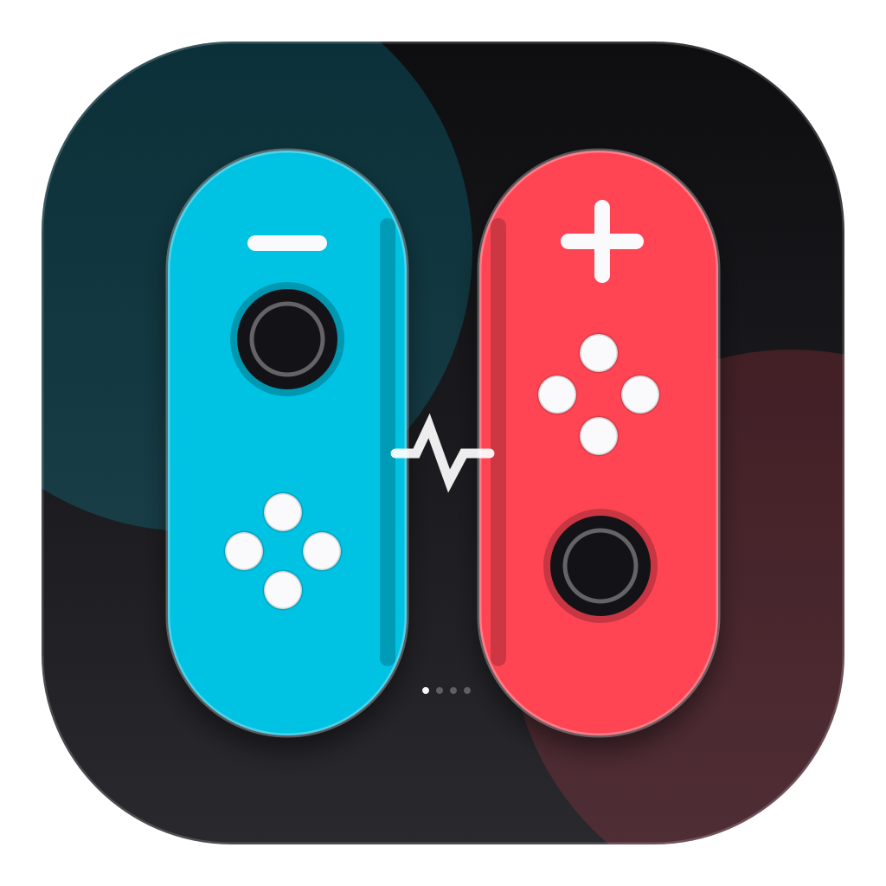

<!-- Header Banner -->

 

## 📱 My Apps / 我的作品

<table>
  <tr>
    <td align="center" width="120">
      
       
      Lifelogs
    </td>
    <td align="center" width="120">
      
       
      小豆语音待办
    </td>
    <td align="center" width="120">
      
       
      小豆 AI
    </td>
    <td align="center" width="120">
      
       
      JoyCon Vibe
    </td>
    <td align="center" width="120">
      
       
      GitKeep
    </td>
  </tr>
</table>

