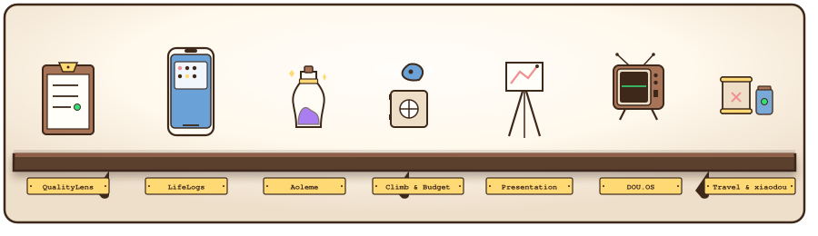
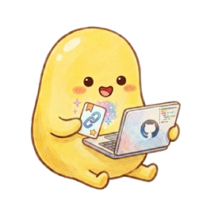

<div align="center">

<!-- Header Capsule Render -->


<!-- Typing Animation Subtitle -->
<a href="https://github.com/isdou">
  
</a>

<br/>

<!-- Status Badges -->
[](https://isdou.info)
[](https://isdou.site)
[](https://github.com/isdou)

</div>

---

## 👤 About Me / 个人档案

```yaml
system_diagnostics:
  status: "ONLINE"
  mbti: "INTJ-A (The Architect)"
  role: "AI Product Manager & Indie Developer"
  location: "Beijing, China 🏙️"
  philosophy: "日常有回应，生活有线索。让技术轻软、安静、有用。"

core_focus:
  - "Designing and building B2B & B2C AI agent applications"
  - "iOS native app development using Swift & SwiftUI"
  - "Warm & retro-modern glassmorphism UI design"
  - "Data aggregation, movie logging (Douban) & digital archiving"
```

---

## 🖼️ DOU.OS Virtual Gallery / 豌豆的虚拟展厅



<br/>
<div align="center">
  <em>欢迎来到我的个人展厅。以下展台按时间与主题陈列了我的代表作，每件展品配有馆藏分析与细节剖析。</em>
</div>
<br/>

<!-- Exhibit No. 01: QualityLens -->
<table width="100%" border="1" cellpadding="12" cellspacing="0" bordercolor="#3d281a">
  <tr bgcolor="#fff8eb">
    <td align="center" colspan="2">
      <font size="1" color="#8e7462" class="mono">—— EXHIBIT NO. 01 ——</font><br/>
      <font size="4" color="#3d281a" face="Georgia, serif"><b>🔍 QualityLens</b></font><br/>
      <font size="2" color="#8e7462"><i>Medium: B2B SaaS, Express, Vite, LLM Clusters</i> &nbsp;|&nbsp; <i>Year: 2026</i></font>
    </td>
  </tr>
  <tr>
    <td width="50%" valign="top" bgcolor="#ffffff">
      <font size="2" color="#8e7462"><b>【 馆藏解析 / Curator's Note 】</b></font><br/>
      专为鞋服与服装供应链打造的 <b>AI 原生售后整改闭环平台</b>。系统对接 Shopify / Amazon Reviews / Zendesk 等 DTC 电商舆情与客服工单流，自动识别售后质量瑕疵，进行舆情聚类与供应商信誉风险评级。
      <br/><br/>
      <details>
        <summary><font size="2" color="#7d685c"><b>⚙️ Diagnostics / 运行参数详情</b></font></summary>
        <br/>
        <pre>
[AI_INTEGRATION]
model = "gemini-2.5-pro"
temperature = 0.15
system_prompt = "CAPA_8D_Expert_Auditor"

[INTEGRATED_DTC]
shopify_webhook = "active"
zendesk_ticket_api = "enabled"
AQL_standard_level = "MIL-STD-105E"
        </pre>
      </details>
    </td>
    <td width="50%" valign="top" bgcolor="#fffcf6">
      <font size="2" color="#8e7462"><b>【 精妙细节 / Highlight Details 】</b></font><br/>
      一键自动生成 8D 纠正整改公函 (CAR) 并配置严肃/扣惩等会签调性；内置实验室级<b>飞织鞋面受热尺寸变异预测模拟器</b>，辅助 CAD 打版片楦头加放防缩水补偿。
    </td>
  </tr>
  <tr bgcolor="#fffdfa">
    <td colspan="2" align="center">
      <font size="2" color="#3d281a"><b>展品特征：</b> 8D 报告一键生成 &nbsp;•&nbsp; 飞织受热变形模拟 &nbsp;•&nbsp; DTC 舆情智能聚类</font>
    </td>
  </tr>
</table>

<br/>

<!-- Exhibit No. 02: LifeLogs -->
<table width="100%" border="1" cellpadding="12" cellspacing="0" bordercolor="#3d281a">
  <tr bgcolor="#fff8eb">
    <td align="center" colspan="2">
      
      <br/>
      <font size="1" color="#8e7462" class="mono">—— EXHIBIT NO. 02 ——</font><br/>
      <font size="4" color="#3d281a" face="Georgia, serif"><b>🌱 Lifelogs (Ply)</b></font><br/>
      <font size="2" color="#8e7462"><i>Medium: iOS Native App, SwiftUI, CoreData, iCloudSync</i> &nbsp;|&nbsp; <i>Year: 2025</i></font>
    </td>
  </tr>
  <tr>
    <td width="50%" valign="top" bgcolor="#ffffff">
      <font size="2" color="#8e7462"><b>【 馆藏解析 / Curator's Note 】</b></font><br/>
      “同一天，五年的你”——记录时间维度中的心路成长，防范时间压缩效应（Temporal Compression Effect）。纯原生 Swift 与 SwiftUI 开发，保障极度流畅的界面动效交互。2025 年 1 月已正式上架 App Store 运营。
      <br/><br/>
      <details>
        <summary><font size="2" color="#7d685c"><b>⚙️ Diagnostics / 运行参数详情</b></font></summary>
        <br/>
        <pre>
[AI_EMOTION_ENGINE]
provider = "DeepSeek-V3"
mbti_tone_mapping = {
  ENTP: "witty/spontaneous",
  INFP: "poetic/empathic",
  ISFJ: "observant/warm"
}
stream_buffer = "enabled"

[STORAGE_ECO]
database = "CoreData.PlyApp"
cloud_provider = "iCloud.CloudKit"
audio_codec = "AAC_Mono_44k"
        </pre>
      </details>
    </td>
    <td width="50%" valign="top" bgcolor="#fffcf6">
      <font size="2" color="#8e7462"><b>【 精妙细节 / Highlight Details 】</b></font><br/>
      深度集成 **DeepSeek API 情感引擎**，在月末基于你的 **MBTI 人格画像类型**（如 ENTP / INFP / ISFJ / ESFP 等）以特定性格语调流式生成专属月度总结报告。内置流式音频记事 (`VoiceRecorderView`) 与精美日记图文卡片导出。
    </td>
  </tr>
  <tr bgcolor="#fffdfa">
    <td colspan="2" align="center">
      <font size="2" color="#3d281a"><b>展品特征：</b> 五年今天时空同屏 &nbsp;•&nbsp; MBTI 专属总结报告 &nbsp;•&nbsp; iCloud 无缝端同步</font>
    </td>
  </tr>
</table>

<br/>

<!-- Exhibit No. 03: Aoleme -->
<table width="100%" border="1" cellpadding="12" cellspacing="0" bordercolor="#3d281a">
  <tr bgcolor="#fff8eb">
    <td align="center" colspan="2">
      <font size="1" color="#8e7462" class="mono">—— EXHIBIT NO. 03 ——</font><br/>
      <font size="4" color="#3d281a" face="Georgia, serif"><b>🧘 熬了么 &amp; UI Skill</b></font><br/>
      <font size="2" color="#8e7462"><i>Medium: Capacitor, React 19, Tailwind, OpenClaw Skill</i> &nbsp;|&nbsp; <i>Year: 2026</i></font>
    </td>
  </tr>
  <tr>
    <td width="50%" valign="top" bgcolor="#ffffff">
      <font size="2" color="#8e7462"><b>【 馆藏解析 / Curator's Note 】</b></font><br/>
      <b>熬了么 App</b>：修仙主题健康与睡眠追踪混合应用。深度集成 Apple HealthKit 接口，将物理运动步数与睡眠数据结算为修仙功德/修为，内置宗门社交与冥界游历游戏系统。
      <br/><br/>
      <details>
        <summary><font size="2" color="#7d685c"><b>⚙️ Diagnostics / 运行参数详情</b></font></summary>
        <br/>
        <pre>
[HEALTHKIT_BRIDGING]
authorized_read = ["steps", "sleep", "heart_rate"]
formula = "merits = steps/1000 + sleep_hours"
sect_affinity_multiplier = 1.05

[REACT_PERFORMANCE]
render_memoization = "active"
lazy_loading_views = 45
gpu_accelerate = "enabled"
        </pre>
      </details>
    </td>
    <td width="50%" valign="top" bgcolor="#fffcf6">
      <font size="2" color="#8e7462"><b>【 精妙细节 / Highlight Details 】</b></font><br/>
      <b>Cyber Fantasy UI Skill</b>：面向 OpenClaw 的智能设计 Skill，专用于生成液态进度条、紫色暗色霓虹与玻璃拟态修仙面板。项目深度实践 React 组件 `memo` 缓存与懒加载代码分割，首屏加载提升超 70%。
    </td>
  </tr>
  <tr bgcolor="#fffdfa">
    <td colspan="2" align="center">
      <font size="2" color="#3d281a"><b>展品特征：</b> 运动步数结算功德 &nbsp;•&nbsp; 赛博霓虹玻璃面板 &nbsp;•&nbsp; 极致组件性能优化</font>
    </td>
  </tr>
</table>

<br/>

<!-- Exhibit No. 04: ClimbOS & Budget -->
<table width="100%" border="1" cellpadding="12" cellspacing="0" bordercolor="#3d281a">
  <tr bgcolor="#fff8eb">
    <td align="center" colspan="2">
      <font size="1" color="#8e7462" class="mono">—— EXHIBIT NO. 04 ——</font><br/>
      <font size="4" color="#3d281a" face="Georgia, serif"><b>🧗 ClimbOS &amp; 记账 App</b></font><br/>
      <font size="2" color="#8e7462"><i>Medium: iOS Client-Side, SwiftUI, CoreData, Charts</i> &nbsp;|&nbsp; <i>Year: 2026</i></font>
    </td>
  </tr>
  <tr>
    <td width="50%" valign="top" bgcolor="#ffffff">
      <font size="2" color="#8e7462"><b>【 馆藏解析 / Curator's Note 】</b></font><br/>
      <b>ClimbOS (climb)</b>：专为攀岩/抱石爱好者设计的训练打卡 App。提供 V-grade (V0-V10+) 难度分布直方图，按岩壁倾角（slab/overhang/cave）及把手类型（crimp/sloper/pinch/pocket）记录攀爬尝试与成功率。
      <br/><br/>
      <details>
        <summary><font size="2" color="#7d685c"><b>⚙️ Diagnostics / 运行参数详情</b></font></summary>
        <br/>
        <pre>
[CLIMBING_ANALYTICS]
v_scale_bounds = ["V0", "V14"]
hold_types = ["crimp", "sloper", "pinch", "pocket"]
plateau_window = "30_days"

[BUDGET_SYSTEM]
db_provider = "CoreData"
budget_categories = 8
warning_threshold = 0.80
        </pre>
      </details>
    </td>
    <td width="50%" valign="top" bgcolor="#fffcf6">
      <font size="2" color="#8e7462"><b>【 精妙细节 / Highlight Details 】</b></font><br/>
      ClimbOS 内置 Plateau 瓶颈分析与自动悬挂板训练计划 (`AutoTrainingPlan`)。<b>Budget App</b> 则是原生 CoreData 记账应用，基于沉浸式<b>深色玻璃拟态 (Dark Glassmorphism)</b> 设计，提供 8 大类目支出趋势看板与超支警告机制。
    </td>
  </tr>
  <tr bgcolor="#fffdfa">
    <td colspan="2" align="center">
      <font size="2" color="#3d281a"><b>展品特征：</b> 攀岩角度与抓手量化 &nbsp;•&nbsp; 抱石 Plateau 智能分析 &nbsp;•&nbsp; 自动指力训练与极简记账</font>
    </td>
  </tr>
</table>

<br/>

<!-- Exhibit No. 05: Presentation Suite -->
<table width="100%" border="1" cellpadding="12" cellspacing="0" bordercolor="#3d281a">
  <tr bgcolor="#fff8eb">
    <td align="center" colspan="2">
      <font size="1" color="#8e7462" class="mono">—— EXHIBIT NO. 05 ——</font><br/>
      <font size="4" color="#3d281a" face="Georgia, serif"><b>📊 Presentation Suite (演示文稿提效链)</b></font><br/>
      <font size="2" color="#8e7462"><i>Medium: React, TS, Google GenAI, Python CLI, Playwright</i> &nbsp;|&nbsp; <i>Year: 2026</i></font>
    </td>
  </tr>
  <tr>
    <td width="50%" valign="top" bgcolor="#ffffff">
      <font size="2" color="#8e7462"><b>【 馆藏解析 / Curator's Note 】</b></font><br/>
      <b>ai-ppt-10-minutes</b>：专为 Google AI Studio 编写的 React + TS Web 应用。集成 `@google/genai` (Gemini SDK) 引擎与 Recharts 可视化库，利用 SCQA、PREP 等汇报模型拆解逻辑，内置 Obsidian 深色与 Minimal Ivory 留白风模板。
      <br/><br/>
      <details>
        <summary><font size="2" color="#7d685c"><b>⚙️ Diagnostics / 运行参数详情</b></font></summary>
        <br/>
        <pre>
[PPT_PIPELINE]
core_engine = "google-genai-sdk"
recharts_compiler = "TS_Vite"
frameworks = ["SCQA", "PREP", "FABE"]

[SLIDES_CLI]
scheduler = ["openai-api", "local-ollama"]
verification = "playwright.chromium"
pixel_tolerance = 0.02
        </pre>
      </details>
    </td>
    <td width="50%" valign="top" bgcolor="#fffcf6">
      <font size="2" color="#8e7462"><b>【 精妙细节 / Highlight Details 】</b></font><br/>
      <b>frontend-slides-cli</b>：基于 Python 开发的模型无关 PPT-HTML 生成 CLI。封装 narrative/design 编译流程，支持 OpenAI 兼容 API 与本地 Ollama (Qwen2.5) 混合调度，结合 Playwright 进行自动化浏览器像素校验。
    </td>
  </tr>
  <tr bgcolor="#fffdfa">
    <td colspan="2" align="center">
      <font size="2" color="#3d281a"><b>展品特征：</b> 幻灯片耗时降至 10min &nbsp;•&nbsp; Ollama/OpenAI 混合调度 &nbsp;•&nbsp; Playwright 像素校验</font>
    </td>
  </tr>
</table>

<br/>

<!-- Exhibit No. 06: DOU.OS / Blog -->
<table width="100%" border="1" cellpadding="12" cellspacing="0" bordercolor="#3d281a">
  <tr bgcolor="#fff8eb">
    <td align="center" colspan="2">
      <font size="1" color="#8e7462" class="mono">—— EXHIBIT NO. 06 ——</font><br/>
      <font size="4" color="#3d281a" face="Georgia, serif"><b>🖥️ DOU.OS / Blog (老式电视机随感站)</b></font><br/>
      <font size="2" color="#8e7462"><i>Medium: React, TailwindCSS, CRT Filters</i> &nbsp;|&nbsp; <i>Year: 2025</i></font>
    </td>
  </tr>
  <tr>
    <td width="50%" valign="top" bgcolor="#ffffff">
      <font size="2" color="#8e7462"><b>【 馆藏解析 / Curator's Note 】</b></font><br/>
      致敬经典 CRT 模拟偏振光栅、动态扫描线和细腻噪波层，极富个性与极客浪漫。整理并归档了个人思想随笔、旅行足迹、美食地图、观影（豆瓣）档案等生活痕迹。
      <br/><br/>
      <details>
        <summary><font size="2" color="#7d685c"><b>⚙️ Diagnostics / 运行参数详情</b></font></summary>
        <br/>
        <pre>
[VISUAL_FILTERS]
phosphor_scanline = "enabled"
bloom_glow_radius = "1.5px"
noise_grain = 0.04

[SOURCE_DATA]
feed_sync = ["douban", "essays", "travel"]
engine = "React + Tailwind"
        </pre>
      </details>
    </td>
    <td width="50%" valign="top" bgcolor="#fffcf6">
      <font size="2" color="#8e7462"><b>【 精妙细节 / Highlight Details 】</b></font><br/>
      主站部署于 <a href="https://isdou.info">isdou.info</a> 与镜像 <a href="https://isdou.site">isdou.site</a>。对界面细节与粒子动效有强迫症式追求，实现了在轻量网页下仿真模拟显像管微弱偏光与电子束扫描效果。
    </td>
  </tr>
  <tr bgcolor="#fffdfa">
    <td colspan="2" align="center">
      <font size="2" color="#3d281a"><b>展品特征：</b> CRT 扫描线偏振光栅 &nbsp;•&nbsp; 生活、观影与旅行足迹归档 &nbsp;•&nbsp; 稳定部署于 isdou.info</font>
    </td>
  </tr>
</table>

<br/>

<!-- Exhibit No. 07: xiaodou & TravelOS -->
<table width="100%" border="1" cellpadding="12" cellspacing="0" bordercolor="#3d281a">
  <tr bgcolor="#fff8eb">
    <td align="center" colspan="2">
      
      <br/>
      <font size="1" color="#8e7462" class="mono">—— EXHIBIT NO. 07 ——</font><br/>
      <font size="4" color="#3d281a" face="Georgia, serif"><b>🫛 小豆 AI &amp; TravelOS (伴侣与旅行)</b></font><br/>
      <font size="2" color="#8e7462"><i>Medium: React Native, Expo 54, Express, TypeScript</i> &nbsp;|&nbsp; <i>Year: 2026</i></font>
    </td>
  </tr>
  <tr>
    <td width="50%" valign="top" bgcolor="#ffffff">
      <font size="2" color="#8e7462"><b>【 馆藏解析 / Curator's Note 】</b></font><br/>
      <b>小豆 (xiaodou)</b>：基于大语言模型个性化微调的 AI 虚拟好友 Companion App 概念。设计聚焦聊天、记事与轻量任务看板（小豆、对话、盒子、我的四大主入口），打造极简温暖的随身陪伴空间。
      <br/><br/>
      <details>
        <summary><font size="2" color="#7d685c"><b>⚙️ Diagnostics / 运行参数详情</b></font></summary>
        <br/>
        <pre>
[AI_COMPANION]
persona = "xiaodou (companion)"
modules = ["chat", "box", "calendar"]
ram_memory = "enabled"

[TRAVEL_GPS]
sdk_level = "Expo_54"
tracking = "geofence_active"
map = "Mapbox_Vector_Tiles"
        </pre>
      </details>
    </td>
    <td width="50%" valign="top" bgcolor="#fffcf6">
      <font size="2" color="#8e7462"><b>【 精妙细节 / Highlight Details 】</b></font><br/>
      <b>TravelOS</b>：轻量级个人行程地图打卡、地理围栏轨迹合并与相册足迹可视化生成工具。前端使用 Expo React Native (SDK 54) 移动客户端，后端采用 Node.js + Express + TypeScript，处于孵化阶段。
    </td>
  </tr>
  <tr bgcolor="#fffdfa">
    <td colspan="2" align="center">
      <font size="2" color="#3d281a"><b>展品特征：</b> 温暖陪伴式大模型微调 &nbsp;•&nbsp; 地理围栏行程足迹合并 &nbsp;•&nbsp; Expo React Native 跨端开发</font>
    </td>
  </tr>
</table>

<br/>

<!-- Exhibit No. 08: GitKeep -->
<table width="100%" border="1" cellpadding="12" cellspacing="0" bordercolor="#3d281a">
  <tr bgcolor="#fff8eb">
    <td align="center" colspan="2">
      
      <br/>
      <font size="1" color="#8e7462" class="mono">—— EXHIBIT NO. 08 ——</font><br/>
      <font size="4" color="#3d281a" face="Georgia, serif"><b>📂 GitKeep</b></font><br/>
      <font size="2" color="#8e7462"><i>Medium: macOS Native App, SwiftUI</i> &nbsp;|&nbsp; <i>Year: 2026</i></font>
    </td>
  </tr>
  <tr>
    <td width="50%" valign="top" bgcolor="#ffffff">
      <font size="2" color="#8e7462"><b>【 馆藏解析 / Curator's Note 】</b></font><br/>
      轻量级 macOS 菜单栏Git仓库管理工具。一键清理本地git仓库冗余文件、快速创建.gitkeep占位文件，保持项目目录结构整洁。原生SwiftUI开发，极简无打扰，常驻菜单栏。
      <br/><br/>
      <details>
        <summary><font size="2" color="#7d685c"><b>⚙️ Diagnostics / 运行参数详情</b></font></summary>
        <br/>
        <pre>
[NATIVE_MAC]
framework = "SwiftUI.AppKit"
menu_bar_only = true
launch_at_login = "supported"

[FEATURES]
batch_create_gitkeep = true
clean_ds_store = true
repo_overview = "quick_view"
        </pre>
      </details>
    </td>
    <td width="50%" valign="top" bgcolor="#fffcf6">
      <font size="2" color="#8e7462"><b>【 精妙细节 / Highlight Details 】</b></font><br/>
      自动扫描文件夹内所有空目录批量生成.gitkeep，一键清除项目中所有.DS_Store文件，支持拖拽仓库快速查看git状态。纯原生开发，内存占用不到10MB，启动即开即用。
    </td>
  </tr>
  <tr bgcolor="#fffdfa">
    <td colspan="2" align="center">
      <font size="2" color="#3d281a"><b>展品特征：</b> 菜单栏常驻 &nbsp;•&nbsp; 批量空目录占位 &nbsp;•&nbsp; 极简原生性能</font>
    </td>
  </tr>
</table>

<br/>

<!-- Exhibit No. 09: TodoVoice -->
<table width="100%" border="1" cellpadding="12" cellspacing="0" bordercolor="#3d281a">
  <tr bgcolor="#fff8eb">
    <td align="center" colspan="2">
      
      <br/>
      <font size="1" color="#8e7462" class="mono">—— EXHIBIT NO. 09 ——</font><br/>
      <font size="4" color="#3d281a" face="Georgia, serif"><b>📝 小豆语音待办</b></font><br/>
      <font size="2" color="#8e7462"><i>Medium: iOS Native App, SwiftUI, SwiftData, App Intents</i> &nbsp;|&nbsp; <i>Year: 2026</i></font>
    </td>
  </tr>
  <tr>
    <td width="50%" valign="top" bgcolor="#ffffff">
      <font size="2" color="#8e7462"><b>【 馆藏解析 / Curator's Note 】</b></font><br/>
      温暖奶油黄风格语音待办App，按住说话自动转文字，智能拆分多条待办，识别自然语言时间设置本地提醒。支持绑定iPhone操作按钮，任何界面一键唤起录音，灵感不等待。
      <br/><br/>
      <details>
        <summary><font size="2" color="#7d685c"><b>⚙️ Diagnostics / 运行参数详情</b></font></summary>
        <br/>
        <pre>
[SPEECH_STACK]
recognizer = "Apple.Speech.Framework"
on_device_recognition = "preferred"
audio_codec = "AVAudioPCM"

[NLP_ENGINE]
date_detector = "NSDataDetector"
sentence_split = "NLTokenizer"
multi_item_parse = "heuristic_semantic"

[INTEGRATION]
app_intents = true
action_button_bind = true
local_notification = "UNUserNotificationCenter"
        </pre>
      </details>
    </td>
    <td width="50%" valign="top" bgcolor="#fffcf6">
      <font size="2" color="#8e7462"><b>【 精妙细节 / Highlight Details 】</b></font><br/>
      采用与Lifelogs一致的温暖奶油黄设计语言，奶油黄渐变背景+金黄色胶囊按钮+奶白色圆角卡片。智能解析"明天下午3点开会 顺便帮我买咖啡"这类句子自动拆分成两条独立待办并分别提取时间。全本地处理不上云，隐私优先。
    </td>
  </tr>
  <tr bgcolor="#fffdfa">
    <td colspan="2" align="center">
      <font size="2" color="#3d281a"><b>展品特征：</b> 语音智能拆条 &nbsp;•&nbsp; 操作按钮一键唤起 &nbsp;•&nbsp; 奶油黄治愈UI &nbsp;•&nbsp; <a href="https://github.com/isdou/TodoVoice" style="color:#F6C94D; text-decoration: none;">Open Source</a></font>
    </td>
  </tr>
</table>

<br/>

---

## 🛠️ Tech Stack Matrix / 技术战力

<div align="center">

**AI & Product Strategy**
<br/>


**Mobile Native Development**
<br/>


**Full-Stack & Archiving**
<br/>


</div>

---

## 📊 GitHub Stats & Streaks

<div align="center">


&nbsp;


<br/>

[](https://git.io/streak-stats)

</div>

---

## 💬 Philosophy / 独白

<div align="center">

> *“最好的产品，是让用户感觉不到 AI 在哪里，只感觉到一切变得更好了。”*
>
> *The best AI product is one where users don't notice the AI — they just feel everything got better.*

</div>

<br/>

<div align="center">

</div>
