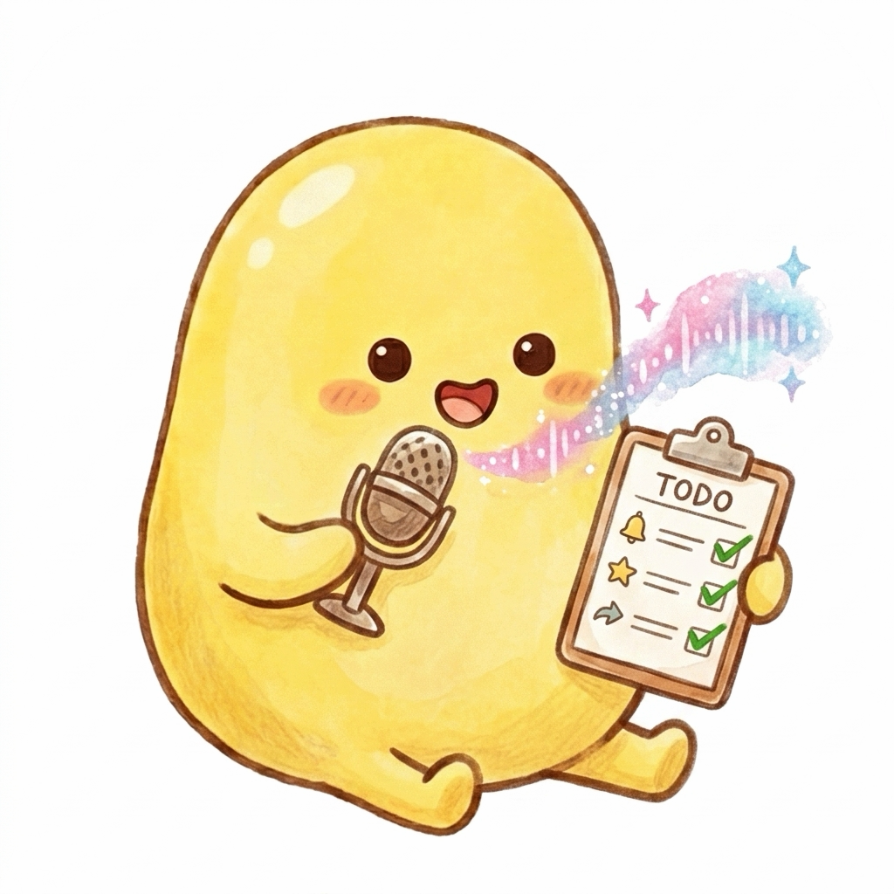
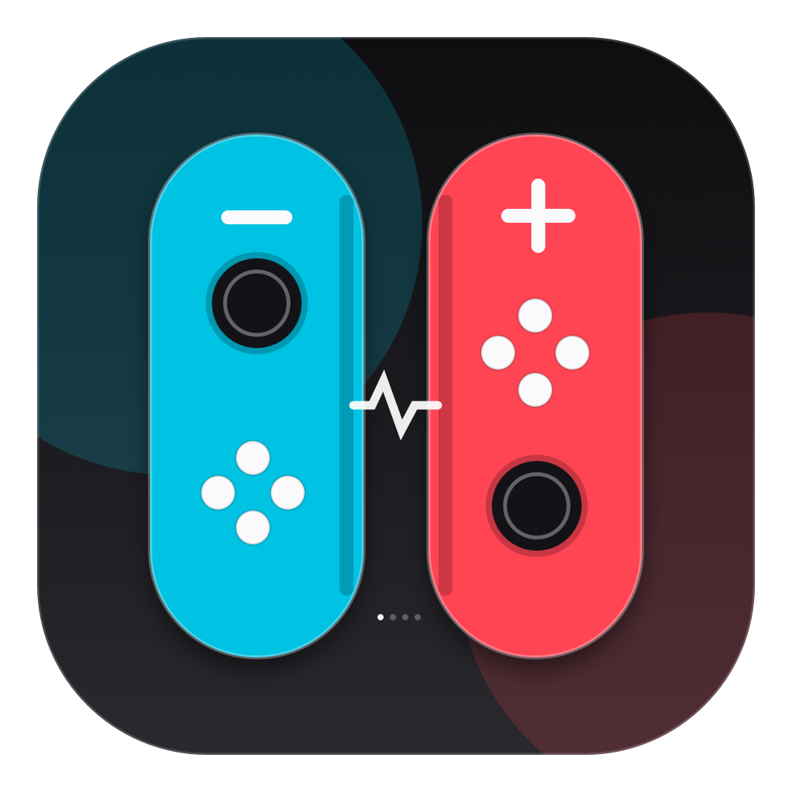
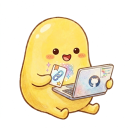
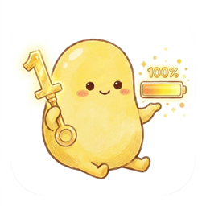

<!-- Header Banner -->

# Hi, I'm 豌豆 (isdou) 👋

**AI 产品经理 · 独立开发者**

📦 ***Perspexi, concepi, creavi.*** — 洞察，构想，创造。

 

## 📱 My Apps / 我的作品

<table>
  <tr>
    <td align="center" width="120">
      
       
      <b>Lifelogs</b>
       
      同一天，多年前的你
    </td>
    <td align="center" width="120">
      
       
      <b>小豆语音待办</b>
       
      说话就能加待办
    </td>
    <td align="center" width="120">
      
       
      <b>小豆 AI</b>
       
      打磨中 🚧
    </td>
    <td align="center" width="120">
      
       
      <b>JoyCon Vibe</b>
       
      Joy-Con 手柄映射
    </td>
    <td align="center" width="120">
      
       
      <b>GitKeep</b>
       
      GitHub 仓库管理
    </td>
    <td align="center" width="120">
      
       
      <b>1Key</b>
       
      AI 额度一站查看
    </td>
  </tr>
</table>

  💡 大部分作品由 AI Pair Programming 完成 —— 想法是我的，代码是我们一起写的。

